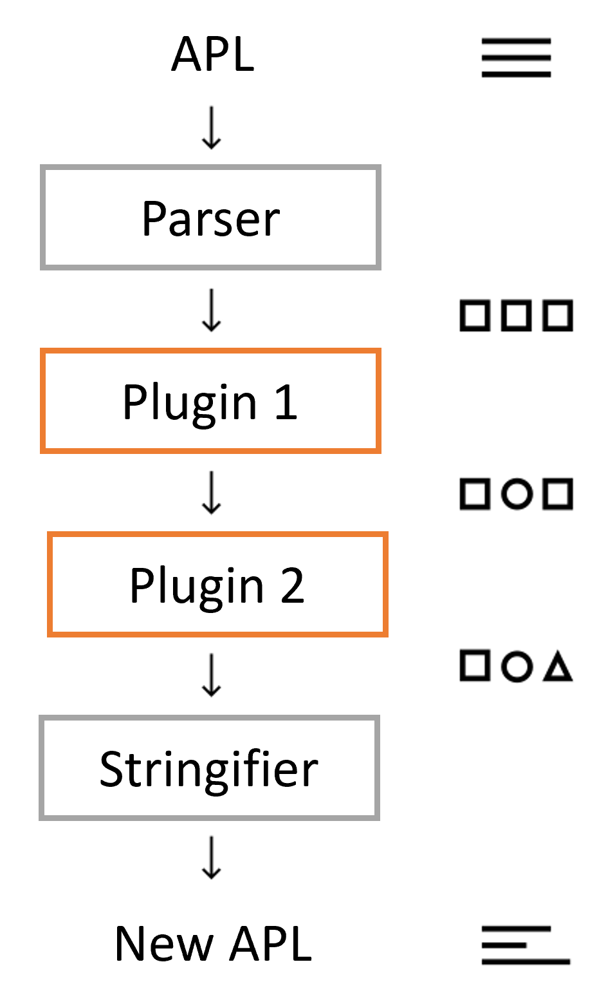

## PostAPL Architecture

General overview of the PostAPL architecture.
It can be useful for everyone who wishes to contribute to the core or develop a better understanding of the tool.

**BIG THANKS** to the creators of [PostCSS](https://github.com/postcss/postcss) for code and inspiration in creating PostAPL. You are giants.

The architecture of PostAPL started with ideas from PostCSS but the solution includes many differences.

**Table of Contents**

* [PostAPL Architecture](#postapl-architecture)
  * [Overview](#overview)
  * [Workflow](#workflow)
  * [Core Structures](#core-structures)

### Overview

> This section describes the basic ideas behind PostAPL

Before diving deeper into the development of PostAPL let's briefly describe it.

**PostAPL**

- *is a tool for APL document transformations*

    It allows you to define custom syntax that could be understandable and transformed by plugins. PostAPL plays the role of a framework for building outstanding tools for APL manipulations.

- *has big aspirations*

    Although just geting started, there are no tools that exist for manipulating APL. Understandable that APL is JSON but converting an APL document to an [Abstract Syntax Tree (AST)](https://en.wikipedia.org/wiki/Abstract_syntax_tree) and then providing APL-specific helper functions is powerful.

### Workflow

This is a high-level overview of the PostAPL workflow

As you can see from the diagram above, PostAPL architecture is pretty straightforward but some parts of it could be misunderstood.

The *Parser*, takes as input an APL document in string form and constructs an [Abstract Syntax Tree (AST)](https://en.wikipedia.org/wiki/Abstract_syntax_tree) as output. The APL document can be valid JSON or JSON with comments.

Each *Plugin* is passed a *Result* object that includes the following properties:

- root - this is the AST root node
- processor - the part of PostAPL responsible for parsing, calling each plugin, and stringify
- opts - any options passed to *processor.process*
- messages - an array of messages that plugins add to instead of using console.log
- apl - at the end of *processor.process*, this property holds the new APL in string format
- json - this is the same as the *apl* property but as a JSON object

Note: the input APL can optionally contain comments but the values, but *apl* and *json* will not have comments.

### Core Structures

 - #### Tokenizer, Parser & Stringifier

    This project uses [json-ast](https://github.com/neuroo/json-ast) for tokenizing, parsing, and stringifing.

- #### Processor [`lib/processor.js`](https://github.com/postapl/postapl/blob/main/lib/processor.js)

    Processor is a very plain structure that initializes plugins and runs syntax transformations

    It exposes only a few public API methods:

    - process(apl, opts)
      - apl - input APL document
      - opt - global configuraiton options

    - parse(apl)
      - apl - APL document

    - deleteMarked(node)
      - node - begining at this node, find all nodes that have a `node.markDelete` property set to `true` and delete them.
